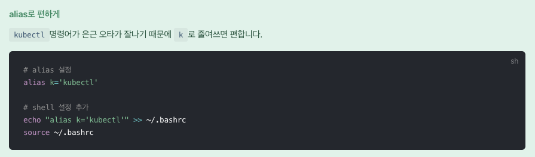
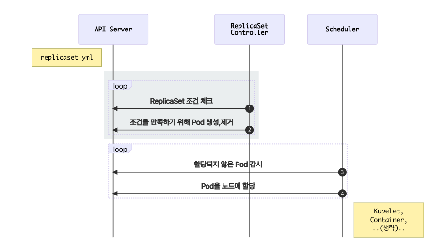

# Kubernetes 학습

# Kubernetes 학습

# Keyword

- 사이즈: Node ← Pod ← Container
1. Node?: 컴퓨팅 자원
2. Pod?: 쿠버네티스 에서의 최소한의 배포 단위
3. Container?: 어플리케이션 배포가 가능한 최소 단위

## MiniKube

1. 쿠버네티스 학습 도구
2. 가상 컴퓨팅 환경을 구축해 클러스터로써 동작하게 해줌 → 테스트 용이!

### Command

1. minikube Command
    1. start : 가상머신 시작
        1. —driver=docker : 도커로 시작
        2. p name : 이름 지정 가능
    2. profile : 현재 사용중인 프로 파일 출력
        1. minikube profile name : 프로 파일 이름 변경
    3. profile list : 프로파일 리스트 출력
    4. delete : 현재 사용중인 profile의 가상머신 제거

## Kubectl

1. 쿠버네티스 CLI

### Command

스크린샷 2023-10-30 오후 3.55.42.png

1. kubectl Command
    1. apply : 원하는 상태 적용
        1. f : 파일 → kubectl -f [파일명 or URL]
    2. get : 리소스 목록 출력 → 여러개 조회도 가능 pod,service,svc
        1. kubectl get type/resource -o : 아웃풋 출력 변경 [yaml, wide, json]
        2. kubectl get type/resource —show-labels: 설정한 라벨 태깅 조회
        3. get pod : 팟 조회 [pod or po or pods 가능]
        4. get replicaset : 레플리카 서비스 조회 [replicaset, rs 가능]
        5. get service : 서비스 조회 [service or svc 가능]
        6. get job : 작업 현황 조회
        7. get deployment : 배포 현황 조회 [deployment, deploy 가능]
        8. get endpoint : 서비스의 접속 정보 [endpoint, ep 가능]
    3. describe : 리소스 상태 출력
        1. kubectl describe type/name : 상세 상태 보기
    4. delete : 리소스 제거
        1. kubectl delete type/name : 리소스 제거
    5. logs : 컨테이너 로그 확인
        1. kubectl logs name : 로그 확인
    6. exec : 컨테이너에 명령 전달 & 실행
        1. kubectl exec -it name — command : 컨테이너 명령어 전달
            1. 컨테이너 접속시 : kubectl exec -it 이름 – bash
            2. c : 여러개의 컨테이너가 있는경우 지정 하는 옵션
    7. config : kubectl 설정 관리
        1. current-context : 현재 컨텍스트 확인
        2. use-context : 컨텍스트 설정
    8. api-resources : 전체 오브젝트 종류 확인
    9. explain obj : 특정 오브젝트 설명 보기
    10. rollout : 한개 또는 여러개의 리소스 관리 [deployments, daemonsets, statusfulsets 타입들 가능]
        1. rollout history name : 변경 내역 확인
        2. rollout undo name : 바로 전으로 롤백
        3. rollout pause name : 업데이트 중지
        4. rollout resume : 업데이트 재개
    11. get

## Spec = 설정 파일 작성

1. yaml 로 작성 가능
    1. refs:
    
    [Kubernetes API Reference Docs](https://kubernetes.io/docs/reference/generated/kubernetes-api/v1.23/#podspec-v1-core)
    
    1. version : 오브젝트 버전 [v1, app/v1, …]
    2. kind : 배포 종류 [Pod, Deployment, ReplicaSet, Service]
    3. metadata : 메타데이터 [name, label, Annotation으로 구성]
    4. spec : 상세 명세 [리소스 마다 다름]
        1. containers: 1-Pod, 1-container가 일반적이나 여러개의 컨테이너도 가능하며
        흔한 편 서로 네트워크와 동일한 디렉터리 공유 가능
        2. 옵션
            - name: 앱 이름
            - image: 이미지 경로
            - env: 설정값, - name과 value를 별도로 정의 해야 함
                - name: REDIS_HOST
                - value: “localhost”
            - livenessProbe: 컨테이너가 정상적으로 동작하는지 체크 후 이상하면 재시작
            - readinessProbe: 컨테이너 준비되었는지 체크 후 준비 되지 않았다면 Pod로 요청하는 요청 제외
    5. 위 4종류는 필수로 정의 해야 함

### Pod

1. 쿠버네티스에서 배포하는 가장 작은 단위
    1. Pod는 여러개의 컨테이너를 가질 수 있음
    2. 도커는 컨테이너를 만들지만 kubernetes 는 팟을 만듬 → 팟은 여러개의 컨테이너를 가질 수 있다

### ReplicaSet

1. Pod를 단독으로 배포하면 Pod에 문제시 자동으로 복구되지 않음
이를 정해진 수만큼 복제하고 관리하는 것이 ReplicaSet임
    1. ReplicaSet은 label을 체크해서 원하는 수의 Pod가 없으면 새로운 Pod를 생성함
        1. spec.selector : label의 체크 조건
        2. spec.replicas : 원하는 pod의 개수
        3. spec.template : 생성할 pod의 명세 → 템플릿
    2. ReplicaSet은 원하는 개수의 Pod를 유지시키지만 label을 이용해 Pod를 체크하므로
    label이 겹치지 않게 조심해야 함
    3. 동작원리

스크린샷 2023-11-08 오후 1.42.18.png

### Deployment

1. 가장 일반적 으로 사용되는 오브젝트이며 내부적으로 ReplicaSet을 이용해서
Pod를 업데이트, 롤백, 특정 버전(revision) 으로 돌아갈 수 있음
2. 업데이트(실제론 새로 생성후 기존 컨테이너 제거)시 새로운 이미지만 업데이트 하면 동작한다
3. straregy
    1. type : 배포 전략 [RollingUpdate]
        1. RollingUpdate
            1. maxSurge : 한번에 몇개씩 생성 할건지
            2. maxUnavailable : 한번에 몇개씩 제거 할건지
4. 동작 원리
    
    
    
    스크린샷 2023-11-08 오후 1.55.18.png
    

### Service

1. Pod는 자체 IP를 가져 Pod끼리 통신이 가능하나 쉽게 삭제되고 생성되는 특징 때문에 권장되지 않음
2. 자체적으로 고정된 IP를 가진 서비스를 만들어 그 서비스를 통해 통신하는 방법을 사용함
3. 동작 흐름
    
    
    
    스크린샷 2023-11-10 오후 3.07.52.png
    
    1. `Endpoint Controller`는 `Service`와 `Pod`을 감시하면서 조건에 맞는 Pod의 IP를 수집
    2. `Endpoint Controller`가 수집한 IP를 가지고 `Endpoint` 생성
    3. `Kube-Proxy`는 `Endpoint` 변화를 감시하고 노드의 `iptables`을 설정
    4. `CoreDNS`는 `Service`를 감시하고 서비스 이름과 IP를 `CoreDNS`에 추가
        1. iptables : 커널 레벨의 네트워크 도구 → 여러 IP에 트래픽 전달
        2. CoreDNS : 빠르고 편리한 클러스터 내부용 도메인 네임서버 → IP 대신 도메인명 사용
4. 종류에 따라 3가지로 분류 됨
    1. Service(ClusterIP)
        1. 클러스터 내부에 새로운 IP를 할당하고 여러개의 Pod를 바라보는 로드밸런서 기능을 제공
        2. 서비스 이름을 내부 도메인에 등록하여 Pod간에 서비스 이름으로 통신 가능
        3. spec.ports.port : 서비스가 생성할 Port
        4. spec.ports.targetPort : 서비스가 접근할 Pod의 Port
        5. spec.selector : 서비스가 접근할 Pod의 Label조건
    2. Service(NodePort)
        1. ClusterIP는 클러스터 내부에서만 접속가능
        2. 외부에서 접속하려면 NodePort 서비스를 개방해야함
    3. Service(LoadBalancer)
        1. NodePort는 노드가 사라졌을때 자동으로 다른 노드를 통해 접근이 불가능함
        2. 이때를 위해 모든 노드를 바라보고 자동으로 살아있는 노드에 접근하기 위한 기능이 필요함
        3. 하지만 클라우드 등이 아니면 특정 서버(노드)를 가르키는 무언가(로드밸런서)가 없을것임
        즉 클라우드에서 주로 사용
        4. 원한다면 Nginx로 포트포워딩 하는 방식으로 사용은 가능할듯?